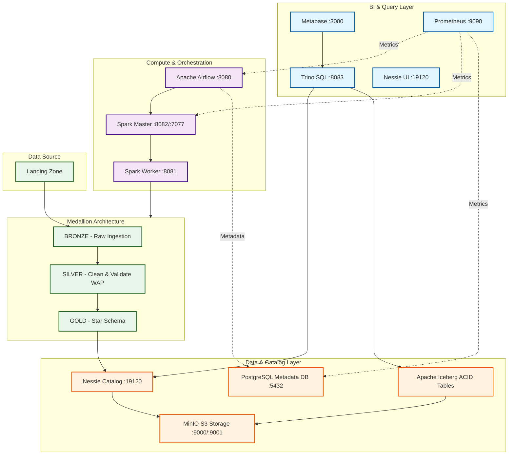
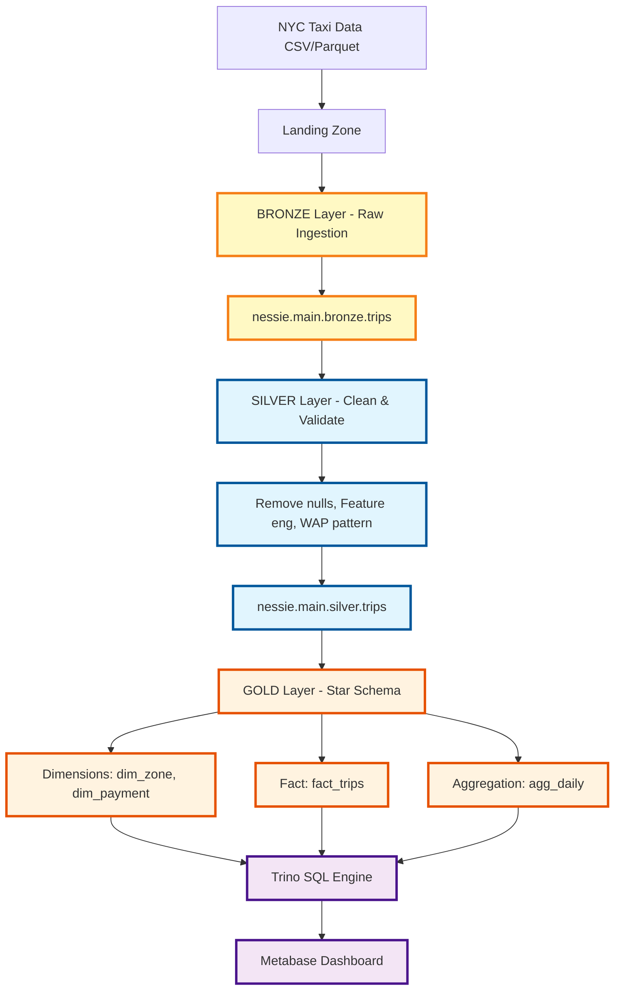

# NYC Taxi Data Lakehouse

> **Data Lakehouse** với Medallion Architecture (Bronze → Silver → Gold) sử dụng Apache Iceberg, Nessie, Spark, Trino và Airflow.

---

## 🏗️ Kiến trúc hệ thống



---

## 📊 Luồng dữ liệu



---

## 🚀 Cài đặt nhanh

### 1️⃣ Setup môi trường

```bash
# Clone repo
git clone <repo-url> && cd lakehouse

# Tạo file .env từ template
cp .env.example .env
nano .env  # Điền credentials: MINIO_ROOT_USER, MINIO_ROOT_PASSWORD, etc.

# Download Spark JARs
python src/utils/download_jars.py

# Download NYC Taxi data
python src/utils/download_data.py
```

### 2️⃣ Khởi động hệ thống

```bash
# Start tất cả services
docker-compose up -d

# Check status
docker-compose ps

# Split data vào Landing Zone
docker compose exec spark-master spark-submit \
  /opt/bitnami/spark/src/utils/split_data_by_day.py
```

### 3️⃣ Chạy pipeline

**Thủ công (một ngày)**:
```bash
DATE="2024-01-15"

# Bronze: Ingest raw
docker compose exec spark-master spark-submit \
  /opt/bitnami/spark/src/pipeline/bronze/ingest_bronze.py --start $DATE

# Silver: Clean & validate
docker compose exec spark-master spark-submit \
  /opt/bitnami/spark/src/pipeline/silver/ingest_silver.py --start $DATE

# Gold: Create analytics
docker compose exec spark-master spark-submit \
  /opt/bitnami/spark/src/pipeline/gold/ingest_gold.py --start $DATE
```

**Hoặc dùng Airflow** (tự động):
1. Mở http://localhost:8080 (login: `airflow` / `airflow123`)
2. Enable DAGs: `bronze_dag`, `silver_dag`, `gold_dag`
3. Trigger manual hoặc đợi schedule chạy

### 4️⃣ Query data

**Trino CLI**:
```bash
docker compose exec trino trino --catalog nessie --schema main.gold

# SQL examples
SELECT COUNT(*) FROM fact_trips;
SELECT * FROM agg_daily ORDER BY pickup_date DESC LIMIT 10;
```

**Metabase**: http://localhost:3000
- Setup Trino connector: Host=`trino`, Port=`8080`, Database=`nessie`, Schema=`main.gold`

---

## 🔧 Các thành phần chính

| Layer | Component | Port | Mô tả |
|-------|-----------|------|-------|
| **Storage** | MinIO | 9000 (API), 9001 (UI) | S3-compatible object storage |
| **Catalog** | Nessie | 19120 | Git-for-Data, WAP pattern, branching |
| **Table Format** | Iceberg | - | ACID, schema evolution, time travel |
| **Compute** | Spark Master | 8082 (UI), 7077 | Job scheduler |
| **Compute** | Spark Worker | 8081 (UI) | Data processing (2 cores, 2GB) |
| **Query** | Trino | 8083 | Distributed SQL engine |
| **BI** | Metabase | 3000 | Dashboard & visualization |
| **Orchestration** | Airflow Web | 8080 | DAG management |
| **Orchestration** | Airflow Scheduler | - | Auto trigger pipelines |
| **Metadata DB** | PostgreSQL | 5432 | Airflow metadata |
| **Monitoring** | Prometheus | 9090 | Metrics collection |

---

## 📁 Cấu trúc dự án

```
lakehouse/
├── docker-compose.yml          # Orchestration tất cả services
├── .env.example                # Template env variables
│
├── conf/                       # Configs
│   ├── spark-defaults.conf     # Spark + Iceberg + Nessie
│   ├── trino/catalog/          # Trino catalog
│   ├── prometheus/             # Monitoring + alerts
│   └── jmx-exporter/           # Metrics export
│
├── src/
│   ├── pipeline/
│   │   ├── bronze/             # Bronze ETL
│   │   ├── silver/             # Silver ETL (clean + validate)
│   │   └── gold/               # Gold ETL (star schema)
│   │
│   ├── airflow/dags/           # Orchestration DAGs
│   │   ├── bronze_dag.py       # Daily bronze ingestion
│   │   ├── silver_dag.py       # Daily silver transform
│   │   ├── gold_dag.py         # Daily gold analytics
│   │   └── maintenance_*.py    # Weekly/monthly maintenance
│   │
│   ├── maintenance/            # Iceberg table maintenance
│   │   ├── compact_tables.py   # Merge small files
│   │   ├── expire_snapshots.py # Remove old snapshots
│   │   └── remove_orphan_files.py
│   │
│   └── utils/                  # Helper scripts
│       ├── download_jars.py    # Download Spark dependencies
│       ├── download_data.py    # Download NYC Taxi data
│       └── split_data_by_day.py # Create Landing Zone
│
└── data/
    ├── landing/                # Landing Zone (daily partitions)
    │   └── YYYY-MM-DD/
    └── taxi_zone_lookup.csv    # Dimension data
```

---

## 🛠️ Bảo trì

### Iceberg Table Maintenance

**Tại sao?**
- **Compact**: Gộp small files → faster reads
- **Expire**: Xóa old snapshots → save storage
- **Orphan**: Xóa unreferenced files → save storage

**Chạy maintenance**:
```bash
# Full maintenance (compact + expire + orphan cleanup)
docker compose exec spark-master spark-submit \
  /opt/bitnami/spark/src/maintenance/run_maintenance.py \
  --mode full \
  --tables nessie.main.bronze.trips nessie.main.silver.trips nessie.main.gold.fact_trips \
  --days-to-keep 30 \
  --retain-last 10
```

**Lịch trình** (qua Airflow DAGs):
- **Weekly** (Chủ nhật 2AM): Compaction
- **Monthly** (Ngày 1 hàng tháng 3AM): Expire + Orphan cleanup

---

## 🖥️ Giao diện quản lý

| Service | URL | Credentials |
|---------|-----|-------------|
| **Airflow** | http://localhost:8080 | `airflow` / `airflow123` |
| **MinIO** | http://localhost:9001 | `admin` / `password` |
| **Spark Master** | http://localhost:8082 | - |
| **Metabase** | http://localhost:3000 | Setup on first run |
| **Nessie API** | http://localhost:19120 | - |
| **Prometheus** | http://localhost:9090 | - |

---

## 💡 Key Features

### WAP (Write-Audit-Publish) Pattern
```python
# Silver layer tạo branch để validate trước khi merge
spark.sql("CREATE BRANCH `wap-silver-2024-01-15` IN nessie FROM main")
spark.sql("USE REFERENCE `wap-silver-2024-01-15` IN nessie")
# ... write data ...
# Validate data quality
# Merge vào main nếu OK
spark.sql("MERGE BRANCH `wap-silver-2024-01-15` INTO main IN nessie")
```

### Nessie Branching (Git-for-Data)
- **Branching**: Tạo staging environment cho data
- **Merging**: Atomic merge sau validation
- **Time Travel**: Query data tại bất kỳ commit nào
- **Rollback**: Revert về version trước nếu lỗi

### Star Schema (Gold Layer)
- **Dimensions**: `dim_zone`, `dim_payment`, `dim_time` (implicit)
- **Fact**: `fact_trips` (mỗi row = 1 trip)
- **Aggregation**: `agg_daily` (pre-computed KPIs)
- **Design**: Xem [`documents/star_schema_design.md`](documents/star_schema_design.md)

---

## 🐛 Troubleshooting

**Pipeline fails "Connection refused"**
```bash
docker-compose logs minio
docker-compose restart minio
```

**Trino không query được**
```bash
docker compose exec trino trino --catalog nessie --schema main.gold --execute "SHOW TABLES"
curl http://localhost:19120/api/v2/config
```

**Airflow DAG stuck**
```bash
docker-compose logs -f airflow-scheduler
docker-compose restart airflow-scheduler
```

**Out of Memory**
```yaml
# Tăng memory trong docker-compose.yml:
SPARK_WORKER_MEMORY=4G  # thay vì 2G
```

---

## 📚 Tài liệu thêm

- [Star Schema Design](documents/star_schema_design.md)
- [NYC Taxi Data Dictionary](documents/nyc_taxi_data_dictionary.md)
- [Maintenance Guide](src/maintenance/README.md)

---

**Updated**: 04/2026
